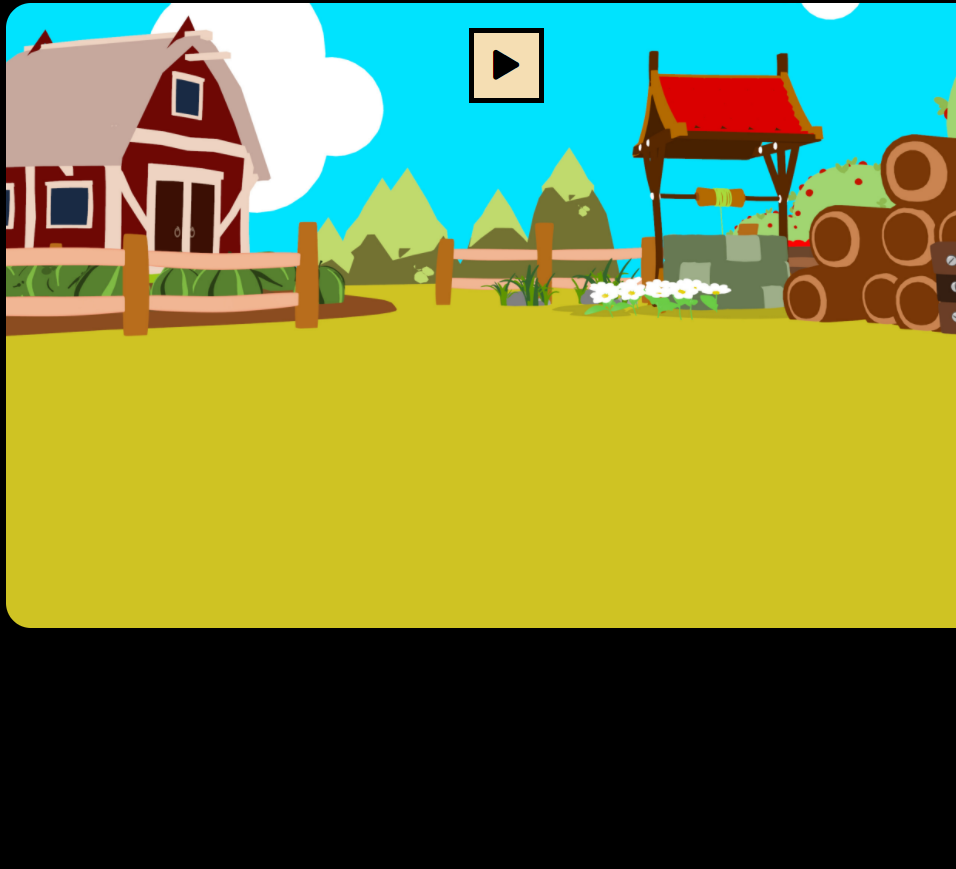
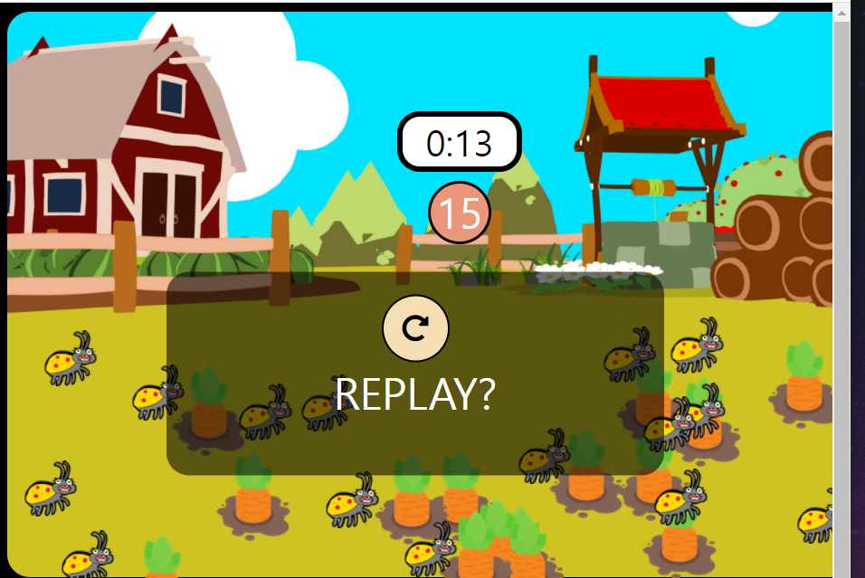

# Game

```JavaScript
// 게임 시작시 버튼을 누를시 나오는 상황
field.addEventListener('click',onFieldClick);
gameBtn.addEventListener('click', () => {
  if(started) {
    stopGame();
  } else {
    startGame();
  }
});

```


***

```JavaScript
// Refresh 버튼을 클릭시 게임이 시작되고 popup창이 사라진다
popUpRefresh.addEventListener('click', () => {
  startGame();
  hidePopUp();
});

```


***