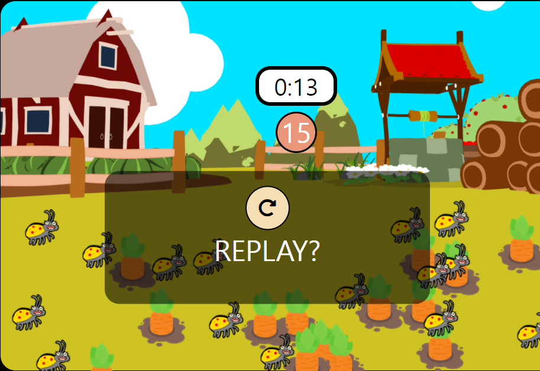

# Game

```JavaScript
// 게임 시작시 버튼을 누를시 나오는 상황
field.addEventListener('click',onFieldClick);
gameBtn.addEventListener('click', () => {
  if(started) {
    stopGame();
  } else {
    startGame();
  }
});

```


***

```JavaScript
// Refresh 버튼을 클릭시 게임이 시작되고 popup창이 사라진다
popUpRefresh.addEventListener('click', () => {
  startGame();
  hidePopUp();
});

```


***

```JavaScript
// 게임이 시작되면 실행되는 것들
function startGame() {
  started = true;
  initGame();
  showStopButton();
  showTimerAndScore();
  startGameTimer();
  playSound(bgSound);
}

// 당근, 벌레 이미지들이 생성된다
function initGame() {
  score = 0;
  field.innerHTML = '';
  gameScore.innerText = CARROT_COUNT;
  // 벌레와 당근을 생성한뒤 field에 추가해줌
  addItem('carrot', CARROT_COUNT, 'img/carrot.png');
  addItem('bug', BUG_COUNT, 'img/bug.png');
}

// 벌레,당근 이미지 생성 시 랜덤으로 field에 생성
function addItem(className, count, imgPath) {
  const x1 = 0;
  const y1 = 0;
  const x2 = fieldRect.width - CARROT_SIZE;
  const y2 = fieldRect.height - CARROT_SIZE;
  for (let i = 0; i < count; i++) {
    const item = document.createElement('img');
    item.setAttribute('class', className);
    item.setAttribute('src', imgPath);
    item.style.position = 'absolute';
    const x = randomNumber(x1, x2);
    const y = randomNumber(y1, y2);
    item.style.left = `${x}px`;
    item.style.top = `${y}px`;
    field.appendChild(item);

  }
}

function randomNumber(min, max) {
  return Math.random() * (max - min) + min;
}

// stop 버튼이 생성
function showStopButton() {
  const icon = gameBtn.querySelector('.fas');
  icon.classList.add('fa-stop');
  icon.classList.remove('fa-play');
  gameBtn.style.visibility = 'visible';
}

// 타이머와 스코어를 보이게 한다
function showTimerAndScore() {
  gameTimer.style.visibility = 'visible';
  gameScore.style.visibility = 'visible';
}

// 1초씩 지나가게 타이머 설치하고 시간이 경과되거나 당근이 다 없어질 시 종료
function startGameTimer() {
  let remainingTimeSec = GAME_DURATION_SEC;
  updateTimerText(remainingTimeSec);
  timer = setInterval(() => {
    if(remainingTimeSec <= 0) {
      clearInterval(timer);
      finishGame(CARROT_COUNT === score);
      return;
    }
    updateTimerText(--remainingTimeSec);
  }, 1000);
}
  // 남은 시간 계산
function updateTimerText(time) {
  const minutes = Math.floor(time / 60);
  const seconds = time % 60;
  gameTimer.innerText = `${minutes}:${seconds}`;
}

// 게임 종료시 타이머가 멈추고, 사운드가 종료되고 popup창이 뜬다
function finishGame(win) {
  started = false;
  hideGameButton();
  if(win) {
    playSound(winSound);
  } else {
    playSound(bugSound);
  }
  stopGameTimer();
  stopSound(bgSound);
  showPopUpWithText(win? ' YOU WON' : 'YOU LOST');
}

// 사운드를 실행
function playSound(sound) {
  sound.currentTime = 0;
  sound.play();
}

```


***