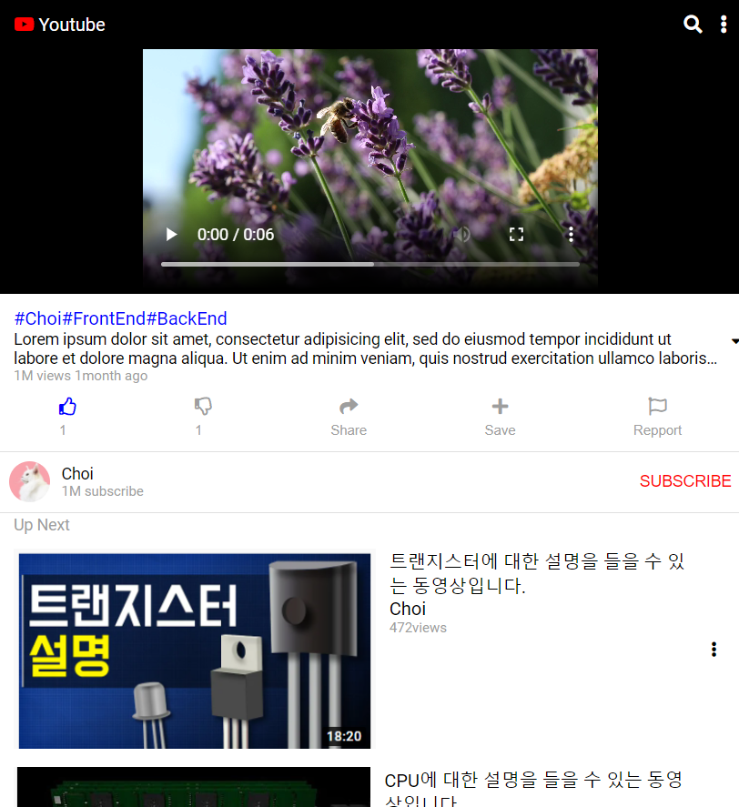

# My Project

- ### [Portfolio](https://github.com/CHOISEOKRYEOL/Portfolio) 🏠
  - **기능:** 저의 스킬과 프로젝트등을 볼 수 있는 포트폴리오 사이트
  - **의도:** 대부분 워드나 파워포인트로 만드는데 다른 방법으로 나를 알릴 수 있는 방법이 뭐가 있을까 생각하다가 포트폴리오 사이트를 만들었습니다.
  - **기간:** 7일
  - **언어:** HTML, CSS , JavaScript
    
    

***
- ### [House](https://github.com/CHOISEOKRYEOL/project/tree/main/House) 🏠
  - **기능:** 중개수수료 및 전반적인 부동산에 대해 의논 할 수 있는 커뮤티니 사이트
  - **의도:** 요즘 부동산 중개개수수료에 관해 논란이 많아 서로 의견을 공유하고자 만들었습니다.
  - **기간:** 7일
  - **언어:** HTML, CSS , JavaScript
    
    
    
***    
- ### [Shoppinglist](https://github.com/CHOISEOKRYEOL/project/tree/main/Shoppinglist) 🎁
  - **기능:** 나의 쇼핑 품목을 의류 종류, 색깔 별로 한 눈에 볼 수 있는 사이트
  - **의도:** 여러 사이트에 장바구니에 있는 것을 한 눈에 볼 수 있으면 좋겠다고 생각하여 만들었습니다.
  - **기간:** 1일
  - **언어:** HTML, CSS , JavaScript
    
    

***  
- ### [Shopping](https://github.com/CHOISEOKRYEOL/project/tree/main/Shopping) 🎁
  - **기능:** 쇼핑리스트를 입력 할 수 있다
  - **의도:** 메모장 형식으로 리스트를 입력 할 수 있는 형식으로 만들어 봤습니다
  - **기간:** 1일
  - **언어:** HTML, CSS , JavaScript
    
    

***  
- ### [Game](https://github.com/CHOISEOKRYEOL/project/tree/main/Game) 🎮
  - **기능:** 시간안에 모든 당근을 클릭하면 이기는 게임
  - **의도:** 어렸을때 이런 휴대폰 게임을 많이 해서 만들어보았고, 방해요소를 더욱 추가시킬 예정입니다.
  - **기간:** 7일
  - **언어:** HTML, CSS , JavaScript
    
    

***  
- ### [Youtube](https://github.com/CHOISEOKRYEOL/project/tree/main/Youtube) ▶
  - **기능:** Youtube
  - **의도:** 메모장에 나의 일정을 기록 할 수 있듯이 영상을 저장하거나 기록해 두면 좋겠다고 생각하야 만들어보았습니다.
  - **기간:** 1일
  - **언어:** HTML, CSS , JavaScript
    
    

