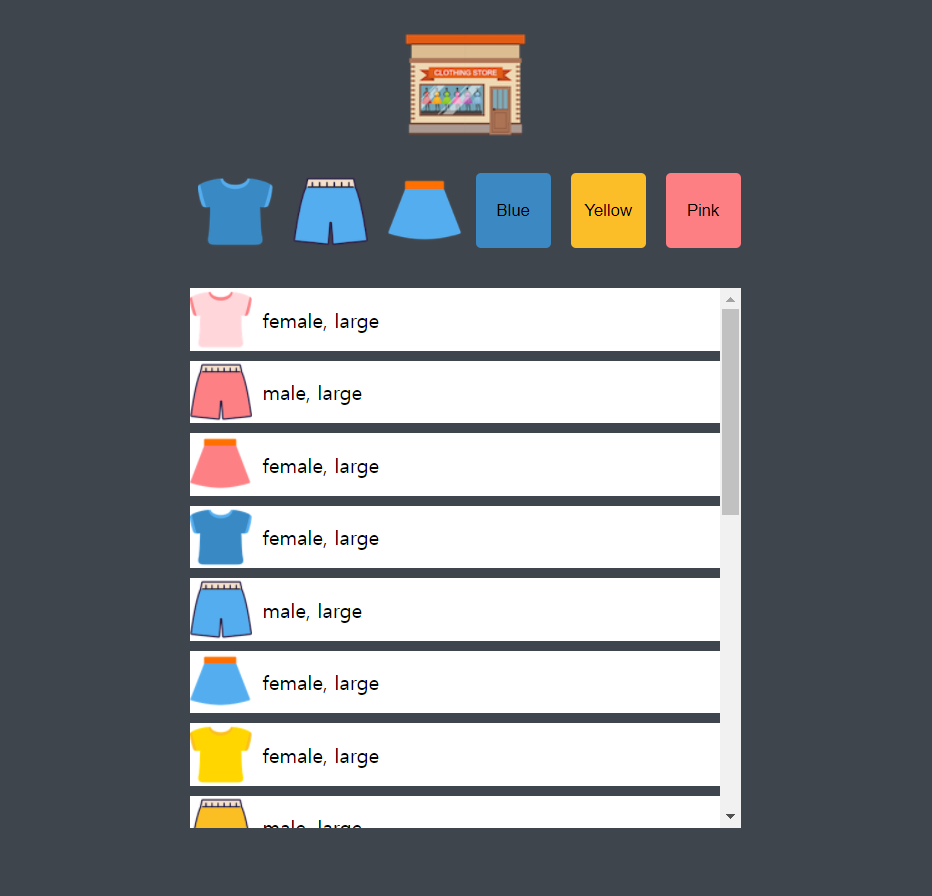
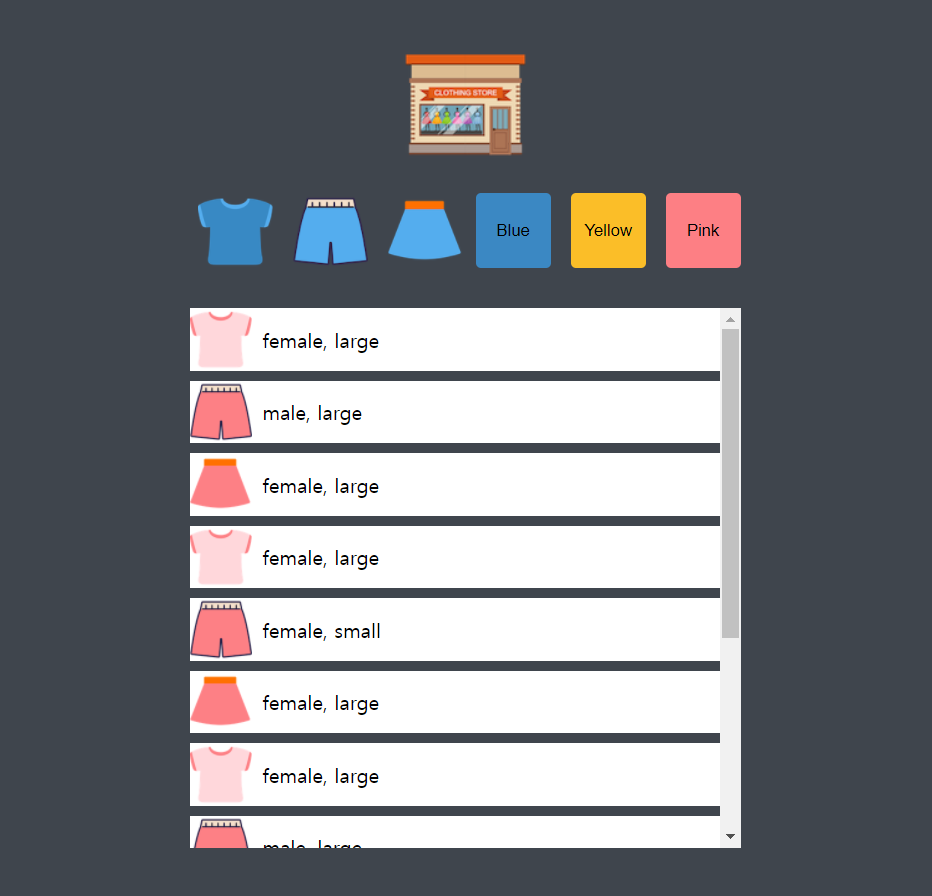

# Shoppinglist

```JavaScript

// 버튼에 eventlistener를 등록
function setEventListeners(items) {
    const logo = document.querySelector('.logo');
    const buttons = document.querySelector('.buttons');
    logo.addEventListener('click', () => displayItems(items));
    buttons.addEventListener('click', event => onButtonClick(event, items));
}

// data를 json형식으로 받아온다
function loadItems() {
    return fetch('data/data.json')
    .then(response => response.json())
    .then(json => json.items);
}

function createHTMLString(item) {
    return `
    <li class="item">
    
    <span class="description">${item.gender}, ${item.size}</span></li>
    `;
}

```


***

```JavaScript

// 각자의 filter값을 불러온다
function onButtonClick(event, items) {

    const dataset = event.target.dataset;
    const key = dataset.key;
    const value = dataset.value;

    if(key == null || value == null) {
        return;
    }

    const filtered = items.filter(item => item[key] === value);
    displayItems(filtered);
}

// 받아온 items들을 HTML에 띄운다
function displayItems (items) {
    const container = document.querySelector('.items');
     container.innerHTML = items.map(item => createHTMLString(item)).join('');
}

// 실행 부분
loadItems()
.then(items => {
     displayItems(items);
     setEventListeners(items);
})
.catch(console.log)

```


***

